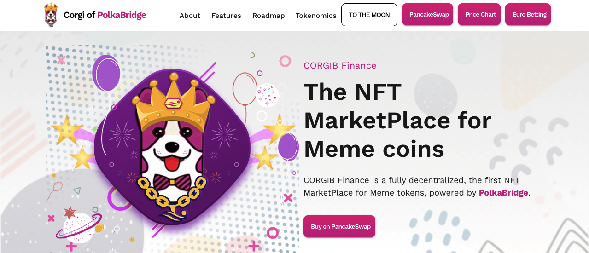

# The CORGI Of PolkaBridge - A Meme Token | Website Landing Page

CORGIB is the NFT MarketPlace for Meme coins build on Binance Smart Chain. Betting Contract for Euro Cup 2021 is also added.

Following features are developed:

1. Euro Cup 2021 Football Tournament betting platform using Binance Smar Chain.
2. Landing Page for the Corgib.
3. MarketPlace for Meme Tokens and NFTs.
## Available Scripts

In the project directory, you can run:

### `yarn start`

Runs the app in the development mode.\
Open [http://localhost:3000](http://localhost:3000) to view it in the browser.

The page will reload if you make edits.\
You will also see any lint errors in the console.

### `yarn build`

Builds the app for production to the `build` folder.\
It correctly bundles React in production mode and optimizes the build for the best performance.

The build is minified and the filenames include the hashes.\
Your app is ready to be deployed!

See the section about [deployment](https://facebook.github.io/create-react-app/docs/deployment) for more information.

